# WheresTheBeer 🍺

<div class="bottom-align">

Roy Koljonen - October 2024

</div>

---

<style scoped>
  p {
    margin-left: 20%;
    margin-right: 20%;
    /* text-align: center; */
  }
</style>

## Overview

WheresTheBeer is a Blazor WebAssembly PWA that helps users find nearby businesses serving beer.
It uses the Google Places API to provide geolocation-based searches, manual location input, and keyword searches.

---

<style scoped>
  section {
    /* text-align: center; */
  }
</style>

## Project Structure

<div style="display: flex;">

<div style="flex: 1; padding: 20px;">

### `WheresTheBeer.Client`

The Blazor WebAssembly client handles the user interface, geolocation, and search functionalities.

</div>

<div style="flex: 1; padding: 20px;">

### `WheresTheBeer` (Server)

The server side proxies Google Places API requests, ensuring security and proper handling of API keys.

</div>

<div style="flex: 1; padding: 20px;">

### `WheresTheBeer.Shared`

Shared models and code

</div>

</div>

---

### Project Structure Diagram



---

#### Geolocation and Reverse Geolocation Search

<div style="display: flex; flex-wrap: wrap;">

<div style="flex: 1; width: 50%; padding: 10px;">

### Automatic Geolocation

Gets the user's current coordinates using `navigator.geolocation` API.

```js
window.getGeolocation = function () {
  return new Promise((resolve, reject) => {
    if (navigator.geolocation) {
      navigator.geolocation.getCurrentPosition(
        (position) => {
          resolve({
            latitude: position.coords.latitude,
            longitude: position.coords.longitude,
          });
        },
        (error) => {
          reject(error.message);
        }
      );
    } else {
      reject('Geolocation is not supported by this browser.');
    }
  });
};
```

</div>

<div style="flex: 1; width: 50%; padding: 10px;">

### Reverse Geocoding

Converts coordinates into a readable location name using Google Geocoding API.

```csharp
[HttpGet("reversegeocode")]
public async Task<IActionResult> GetCityFromCoordinates(
  [FromQuery] double latitude,
  [FromQuery] double longitude)
{
  var formLat = latitude.ToString(CultureInfo.InvariantCulture);
  var formLong = longitude.ToString(CultureInfo.InvariantCulture);

  var geocodeUrl = @$"https://maps.googleapis.com/maps/api/geocode/json?
                  latlng={formLat},{formLong}&
                  key={_apiKey}";
  var response = await _httpClient.GetAsync(geocodeUrl);
  if (!response.IsSuccessStatusCode)
  {
      return StatusCode(
        (int)response.StatusCode,
        "Failed to retrieve city from Google Geocoding.");
  }
  var content = await response.Content.ReadAsStringAsync();
  return Ok(content);
}
```

Example:
`GET /reversegeocode?latitude=37.7749&longitude=-122.4194`

</div>
</div>

---

#### Nearby Search with Google Places API

<br>

<div style="display: flex; flex-wrap: wrap;">

<div style="flex: 1; width: 50%; padding: 10px;">

- `/nearby` endpoint takes `location` (latitude,longitude) and `radius` (default: 200m) as query parameters.
- Sends a GET request to Google Places API to find nearby bars. (`serves_beer` not used widely enough)
- Returns the list of results after deserializing the JSON response.

</div>

<div style="flex: 1; width: 50%; padding: 10px;">

```csharp
[HttpGet("nearby")]
public async Task<IActionResult> GetNearbyPlaces(
  [FromQuery] string location,
  [FromQuery] int radius = 200)
{
  var googlePlacesUrl =
    $"https://maps.googleapis.com/maps/api/place/nearbysearch/json" +
    $"?location={location}" +
    $"&radius={radius}" +
    $"&type=bar" +
    $"&key={_apiKey}";

  var response = await _httpClient.GetAsync(googlePlacesUrl);
  if (!response.IsSuccessStatusCode)
  {
      return StatusCode((int)response.StatusCode,
        "Failed to retrieve data from Google Places.");
  }

  var rawContent = await response.Content.ReadAsStringAsync();
  var placesResponse = JsonSerializer.Deserialize<GooglePlacesResponse>(
    rawContent, new JsonSerializerOptions
    { PropertyNameCaseInsensitive = true });

  return Ok(placesResponse.Results);
}
```

</div>

</div>

---

#### Keyword Search

<br>

<div style="display: flex; flex-wrap: wrap;">

<div style="flex: 1; width: 50%; padding: 10px;">

- `/keywordsearch` endpoint takes `keyword` (location name) and `radius` (default: 200m) as query parameters.
- Uses Google Geocoding API to convert the keyword into coordinates.
- Sends the coordinates to Google Places API to find nearby bars.
- Returns the list of results.

</div>

<div style="flex: 1; width: 50%; padding: 10px;">

```csharp
[HttpGet("keywordsearch")]
public async Task<IActionResult> GetBarsNearKeyword(
  [FromQuery] string keyword,
  [FromQuery] int radius = 200)
{
  if (string.IsNullOrEmpty(keyword))
  { return BadRequest("Keyword is required."); }
  var geocodeUrl =
    $"https://maps.googleapis.com/maps/api/geocode/json" +
    $"?address={keyword}" +
    $"&key={_apiKey}";
  var geocodeResponse = await _httpClient.GetAsync(geocodeUrl);
  if (!geocodeResponse.IsSuccessStatusCode)
  {
    return StatusCode((int)geocodeResponse.StatusCode,
      "Failed to retrieve location from keyword.");
  }
  var geocodeContent = await geocodeResponse.Content.ReadAsStringAsync();
  var geocodeData = JsonSerializer.Deserialize<GeocodeResponse>(
    geocodeContent, new JsonSerializerOptions
    { PropertyNameCaseInsensitive = true });
  if (geocodeData?.Results?.Count == 0)
  {
    return NotFound("No location found for the given keyword.");
  }
  var location = geocodeData.Results[0].Geometry.Location;

  ... (Google Places API request)

  return Ok(placesResponse.Results);
}
```

</div>

</div>

---

#### Progressive Web App

<br>

<div style="display: flex; flex-wrap: wrap;">

<div style="flex: 1; width: 50%; padding: 10px;">

- `initializePWAInstall` captures the `beforeinstallprompt` event.
- Shows install button when app is ready to install.

- A PWA can be installed on a user's device, making it work like a native app.
  - Works on all devices and operating systems.
  - Can be accessed without an internet connection using cached data.
  - No app store needed: install directly from the browser.

</div>

<div style="flex: 1; width: 50%; padding: 10px;">

```js
window.initializePWAInstall = function () {
  let deferredPrompt;
  const installButton = document.getElementById('installPWA');

  window.addEventListener('beforeinstallprompt', (e) => {
    e.preventDefault();
    deferredPrompt = e;
    installButton.style.display = 'block';

    installButton.addEventListener('click', async () => {
      deferredPrompt.prompt();
      const { outcome } = await deferredPrompt.userChoice;

      if (outcome === 'accepted') {
        console.log('User accepted the install prompt');
      } else {
        console.log('User dismissed the install prompt');
      }

      deferredPrompt = null;
      installButton.style.display = 'none';
    });
  });
};
```

</div>

</div>

---

#### Questions?

<div class="bottom-align">

### (Thank you)

</div>
