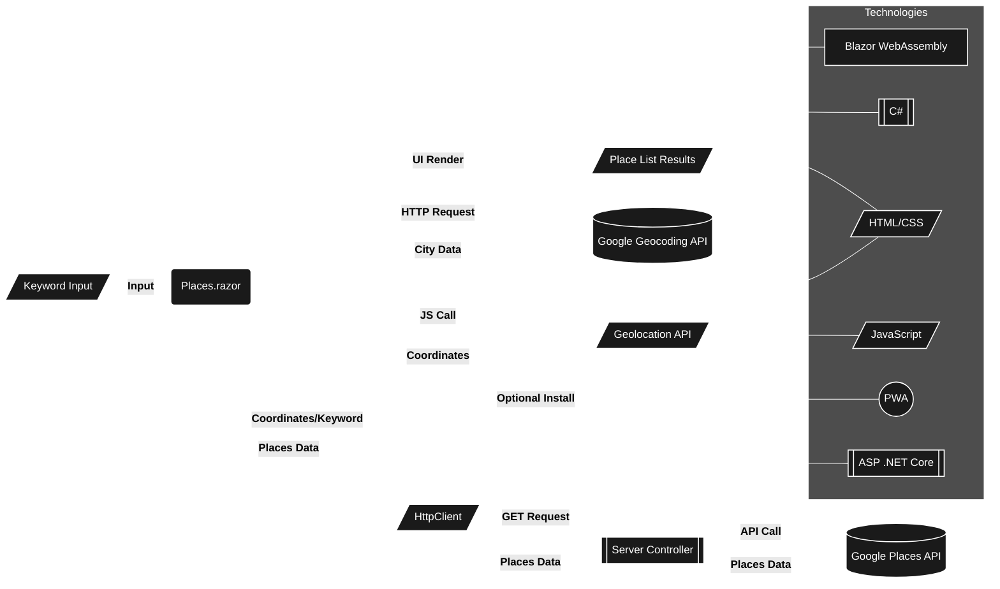

```mermaid
graph LR

    %% Define global styles
    classDef dark fill:#1a1a1a,stroke:#ffffff,stroke-width:1.5px,color:white;
    classDef subgraphStyle fill:#4d4d4d,stroke:#ffffff,stroke-width:2px,color:white;
    classDef edgeStyle stroke:#ffffff,stroke-width:2px,color:#ffffff;
    classDef labelStyle fill:none,stroke:none,color:#ffffff,font-weight:bold;


    %% Client-Side Flow
    A[/Keyword Input/] -->|Input| B1(Places.razor)
    B1 -->|Coordinates/Keyword| C1[/HttpClient/]
    C1 -->|GET Request| C2[[Server Controller]]
    B1 ---- Tech1 & Tech6

    %% Server-Side Flow
    C2 -->|API Call| C3[(Google Places API)]
    C3 -->|Places Data| C2
    C2 -->|Places Data| C1

    %% Client Data Rendering
    C1 -->|Places Data| B1
    B1 --->|UI Render| A1[/Place List Results/] --- Tech7

    %% Geolocation and Reverse Geocoding Flow
    B1 --->|JS Call| B3[/Geolocation API/] -->|Coordinates| B1
    B1 --->|HTTP Request| D2[(Google Geocoding API)]
    D2 -->|City Data| B1

    %% Technologies Used
    subgraph Technologies
      Tech1[Blazor WebAssembly]
      Tech6[[C#]]
      Tech7[/HTML/CSS/]
      Tech4[/JavaScript/]
      Tech5((PWA))
      Tech2[[ASP .NET Core]]
    end

    class Technologies subgraphStyle;

    %% Apply global style to all nodes
    class A,B1,C1,C2,C3,A1,B3,D2,Tech1,Tech2,Tech3,Tech4,Tech5,Tech6,Tech7 dark;

    %% Global link styling (line and label color)
    linkStyle default stroke:#ffffff,stroke-width:1px,color:black,font-weight:bold;

    %% Linking technologies
    B1 --- Tech7
    C1 --- Tech2
    B3 --- Tech4
    B1 ----|Optional Install| Tech5

```
